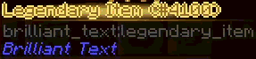
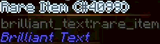
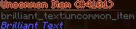
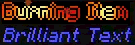

# Brilliant Text

A Library for Minecraft 1.12.2 that allows you to give your text more flare. Inspired by similar looking tooltips that
exist in Terraria. This mod pairs well with
the [Legendary Tooltips](https://www.curseforge.com/minecraft/mc-mods/legendary-tooltips) mod.

## How to use

Out-of-the-box the library provides multiple formatting codes you can use like vanilla formatting codes. Any custom
formatting from this mod applied to a text will override any vanilla formatting that text had previously.

> [!note]
> These codes must be at the beginning of a line. Doing something like `Hello §gMinecraft` ****will not work****.
> The ability to only apply the formatting to a specific part of the text is not possible yet.

> `§g`: Makes the text look shiny and golden
>
> Example: `§gLegendary Item`
>
> 

> `§s`: Makes the text look silver
>
> Example: `§sRare Item`
>
> 

> `§qUncommon Item`: Makes the text look bronze
>
> Example: `§qUncommon Item`
>
> 

> `§v`: Make the text look like it's on fire
>
> Example: `§vBurning Item`
>
> 

## Custom Colors

> [!note]
> As of now custom colors cannot be solely defined in a config, although this is planned for the future.

If you want to customize the text, outline, glow and particle colors, you can create a new shader that implements the
`IOutlinedTextShader` interface. From there you can customize the hex color codes for each component.

> [!important]
> The hex color is stored as `ARGB` instead of the more common `RGBA`

> For example, this is how the `GoldShader` is implemented internally:
> ```java
> public class GoldShader implements IOutlinedTextShader {
>     private static final ResourceLocation PARTICLE_TEXTURE = new ResourceLocation(
>             BrilliantText.MODID,
>             "textures/particles/glow.png"
>     );
> 
>     @Override
>     public Integer getTextColor() {
>         return 0xFF986B31;
>     }
> 
>     @Override
>     public Optional<Integer> getGlowColor() {
>         return this.getOutlineColor();
>     }
> 
>     @Override
>     public Optional<Integer> getOutlineColor() {
>         return Optional.of(0xFFFCE670);
>     }
> 
>     @Override
>     public Optional<ParticleSettings> getSettingsForNewParticle() {
>         Minecraft mc = Minecraft.getMinecraft();
>         return Optional.of(
>                 ParticleSettings.builder()
>                         .resourceLocation(PARTICLE_TEXTURE)
>                         .color(this.getOutlineColor().get())
>                         .maxLifetime(200)
>                         .particleEveryXFrames(100)
>                         .startingRotationDegrees(mc.world.rand.nextInt(360))
>                         .rotationPerFrame(mc.world.rand.nextFloat())
>                         .dimensions(mc.world.rand.nextInt(4) + 2)
>                         .build()
>         );
>     }
> }
> ```

From there you need to bind the shader to a character using the static `bindCharToShader(char, ITextShader)` method of
the
`BrilliantTextManager` class. This should be done in a `init()` method of a `ClientProxy` class.


> [!warning]
> The character **must not** be one that minecraft already uses for formatting.
> The following characters are used already and cannot be passed: `0123456789abcdefklmnor`

> Example registering the `GoldShader`:
> ```java
> public class ClientProxy extends CommonProxy {
>     @Override
>     public void preInit() {
>         // ...
>         BrilliantTextManager.bindCharToShader(FormatCharacter.tryFrom('g'), new GoldShader());
>         // ...
>     }
> }
> ```

## Custom Shaders

If you want to implement something brand new, you first need to bind your custom vertex and fragment shaders in a 
`ClientProxy.init()` method using the `BrilliantShaderManager.registerShader(String, ResourceLocation, ResourceLocation)`
method.

> Example from the default shader:
> ```java
> @SideOnly(Side.CLIENT)
> public class BrilliantTextManager {
>     public static final ResourceLocation FLAME_VERTEX_SHADER = new ResourceLocation(
>             BrilliantText.MODID,
>             "shaders/post/flame.vert"
>     );
>  
>     public static final ResourceLocation FLAME_FRAGMENT_SHADER = new ResourceLocation(
>             BrilliantText.MODID,
>             "shaders/post/flame.frag"
>     );
>
>     public static final String FLAME_SHADER_DESIGNATION = "flame";
> 
>     public static void init() {
>         // ...
>         
>         BrilliantShaderManager.registerShader(
>                  FLAME_SHADER_DESIGNATION,
>                  FLAME_FRAGMENT_SHADER,
>                  FLAME_VERTEX_SHADER
>         );
>         
>         // ...
>     }
> }
> ```

> [!note]
> These shaders receive the following `uniforms` by default
>
> ```glsl
> // The Framebuffer object sampler that contains all of the text which should be formatted
> uniform sampler2D u_texture;
> // The size of the Framebuffer texture. This contains the scaled window width and height 
> uniform vec2 u_textureSize;
> // The top left coordinates (x, y) of the text
> uniform vec2 u_stringTopLeft;
> // The bottom right coordinates (x, y) of the text
> uniform vec2 u_stringBottomRight;
> ```

You can then create a new class that implements the `ITextShader` interface. 

> [!important]
> Be sure to call `ITextShader.super.renderPass()` when implementing the `renderPass()` method, or else the `uniforms` that are listed above won't be passed.

> Example implementation of the `FlameTextShader`:
> ```java
> public class FlameTextShader implements ITextShader {
>     @Override
>     public int getShaderProgramId() throws ShaderNotFoundException {
>         return BrilliantShaderManager.getProgramId(FLAME_SHADER_DESIGNATION)
>                 .orElseThrow(() -> new ShaderNotFoundException("Flame shader program not registered"));
>     }
> 
>     @Override
>     public void renderPass(
>             BufferBuilder buffer,
>             BrilliantTextData brilliantTextData,
>             ScaledResolution res
>     ) {
>         ITextShader.super.renderPass(buffer, brilliantTextData, res);
>         // Drawing Code...
>     }
> }
> ```

Finally, you need to bind the shader to a character as explained in the [Custom Colors Section](#custom-colors)