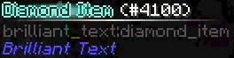

#  Brilliant Text

A Library for Minecraft 1.12.2 that allows you to give your text more flare. Inspired by similar looking tooltips that
exist in Terraria. This mod pairs well with
the [Legendary Tooltips](https://www.curseforge.com/minecraft/mc-mods/legendary-tooltips) mod.

## How to use

Out-of-the-box the library provides multiple formatting codes you can use like vanilla formatting codes. When applying
the custom formatting, the text dropShadow will be ignored and not drawn.

> `§h`: Makes the text look blue, resembling diamonds
>
> Example: `§hDIamond Item`
>
> 

> `§g`: Makes the text look shiny and golden
>
> Example: `§gLegendary Item`
>
> 

> `§s`: Makes the text look silver
>
> Example: `§sRare Item`
>
> 

> `§qUncommon Item`: Makes the text look bronze
>
> Example: `§qUncommon Item`
>
> 

> `§v`: Make the text look like it's on fire
>
> Example: `§vBurning Item`
>
> 

## Custom Colors

### Config

You can define custom colors in the `brilliant_text_bindings.json` file located in the `config` folder. There you have a
mapping of characters to text shader definitions.

> For example, the bronze shader:
>```json
>{
>  "q": {
>    "textColors": [
>      "FF60241E"
>    ],
>    "outlineColors": [
>      "FFE77B49"
>    ]
>  }
>}
>```
> This maps the character `q` to a new text shader which will possess the specified colors.

#### Text Shader Definition

> [!important]
> A `color` field with more than one color in its list makes the thing the color is applied to smoothly cycle between
all the defined colors. If a list has no elements, nothing is drawn.
>
> An object with the `min` and `max` properties will choose a random value between `min` and `max`.
> For example:
> ```json lines
> {
>   "dimensions": {
>     "min": 1,
>     "max": 5
>   }
> }
> ```
> Will choose a random value between `1` up to `4`

A text shader definition can have the following fields

```json lines
{
  "m": {
    // A list of ARGB hex colors that the text will be drawn with
    "textColors": [
      "FF4C5E6F"
    ],
    // A list of ARGB hex colors that the outline will be drawn with
    "outlineColors": [
      "FFD5EAF8",
      "FFF0F7FA"
    ],
    // A list of ARGB hex colors that the glow will be drawn with
    "glowColors": [
      "FFFFFFFF"
    ],
    // The configuration for particles. Remove this if you don't want to spawn any particles
    "particleConfig": {
      // The texture of the particle. Can be any minecraft / mod texture. Must be a valid ResourcePath
      "texture": {
        "namespace": "brilliant_text",
        "path": "textures/particles/glow.png"
      },
      // The hex color of the particle
      "color": "FFD5EAF8",
      // A 1 in x chance of spawning the particle every tick
      // 1-inf
      "rarity": 20,
      // The lifetime of the particle in ticks
      // 0-inf
      "lifetime": 40,
      // The width and height of the particle
      "dimensions": {
        // 1-inf
        "min": 4.0,
        // 1-inf
        "max": 6.0
      },
      // The starting rotation of the particle
      "rotation": {
        // 0-inf
        "min": 1.0,
        // 0-inf
        "max": 360.0
      },
      // The amount the particle rotates every tick
      "rotationsPerFrame": {
        // 0-inf
        "min": 0.0,
        // 0-inf
        "max": 1.0
      },
      // Whether the particle should shrink during its lifetime
      "shouldShrink": true
    },
    // The configuration for the 'wiper' effect that goes across the text. Remove this if you don't want this effect
    "wiperConfig": {
      // The color of the wiper
      "color": "FFFFFFFF",
      // How slow the wiper is, higher number = slower (0-inf)
      "slowdown": 50
    }
  }
}
```

> [!note]
> The code for this data structure is
in [ShaderDefinition.java](src/main/java/brilliant_text/config/ShaderDefinition.java)

### Code

If you want to customize the text, outline and glow directly in the code, you can create a new shader that implements
the
`IOutlinedTextShader` interface. If you also want that shader to spawn particles, you need to implement the
`IParticleSpawner` interface as well. From there you can customize the hex color codes for each component.

> [!important]
> The hex color is stored as `ARGB` instead of the more common `RGBA`

> For example, this is how the `GoldShader` would be implemented internally:
> ```java
> public class GoldShader implements IOutlinedTextShader, IParticleSpawner {
> 
>     @Override
>     @Nonnull
>     public NonNullList<Integer> getTextColors() {
>         return NonNullList.withSize(1, 0xFF986B31);
>     }
> 
>     @Override
>     @Nonnull
>     public NonNullList<Integer> getGlowColors() {
>         return this.getOutlineColor();
>     }
> 
>     @Override
>     @Nonnull
>     public NonNullList<Integer> getOutlineColors() {
>         return NonNullList.withSize(1, 0xFFFCE670);
>     }
> 
>     @Override
>     public boolean shouldSpawnParticle(@Nonnull Random random) {
>         return random.nextInt(20) == 0;
>     } 
> 
>     @Override
>     public ParticleSettings getNewParticle(@Nonnull BrilliantTextData data) {
>         Random rand = RandomInstance.getInstance();
>         return new BrilliantParticleBuilder(GLOW_PARTICLE_TEXTURE_1, data.aabb.getRandomPositionInside())
>               .color(this.getOutlineColor().get())
>               .lifetime(200)
>               .rotation(rand.nextInt(360))
>               .rotationsPerFrame(rand.nextFloat())
>               .dimensions(rand.nextInt(4) + 2)
>               .build();
>     }
> }
> ```

From there you need to bind the shader to a character using the static `bindCharToShader(char, ITextShader)` method of
the `BrilliantTextManager` class. This should be done in a `init()` method of a `ClientProxy` class.


> [!warning]
> The character **must not** be one that minecraft already uses for formatting.
> The following characters are used already and cannot be passed: `0123456789abcdefklmnor`

> Example registering the `GoldShader`:
> ```java
> public class ClientProxy extends CommonProxy {
>     @Override
>     public void preInit() {
>         // ...
>         BrilliantTextManager.bindCharToShader(FormatCharacter.tryFrom('g'), new GoldShader());
>         // ...
>     }
> }
> ```

## Custom Shaders

If you want to implement something brand new, you first need to bind your custom vertex and fragment shaders in a
`ClientProxy.init()` method using the
`BrilliantShaderManager.registerShader(String, ResourceLocation, ResourceLocation)`
method.

> Example from the default shader:
> ```java
> @SideOnly(Side.CLIENT)
> public class BrilliantTextManager {
>     public static final ResourceLocation FLAME_VERTEX_SHADER = new ResourceLocation(
>             BrilliantText.MODID,
>             "shaders/post/flame.vert"
>     );
>  
>     public static final ResourceLocation FLAME_FRAGMENT_SHADER = new ResourceLocation(
>             BrilliantText.MODID,
>             "shaders/post/flame.frag"
>     );
>
>     public static final String FLAME_SHADER_DESIGNATION = "flame";
> 
>     public static void init() {
>         // ...
>         
>         BrilliantShaderManager.registerShader(
>                  FLAME_SHADER_DESIGNATION,
>                  FLAME_FRAGMENT_SHADER,
>                  FLAME_VERTEX_SHADER
>         );
>         
>         // ...
>     }
> }
> ```

> [!note]
> These shaders receive the following `uniforms` by default
>
> ```glsl
> // The Framebuffer object sampler that contains all of the text which should be formatted
> uniform sampler2D u_texture;
> // The size of the Framebuffer texture. This contains the scaled window width and height 
> uniform vec2 u_scaledScreenSize;
> // The top left coordinates (x, y) of the text
> uniform vec2 u_stringTopLeft;
> // The bottom right coordinates (x, y) of the text
> uniform vec2 u_stringBottomRight;
> // A time variable set to the system time in milliseconds
> uniform float u_time;
> ```

You can then create a new class that implements the `ITextShader` interface.

> [!important]
> Be sure to call `ITextShader.super.renderPass()` when implementing the `renderPass()` method, or else the `uniforms`
that are listed above won't be passed.

> Example implementation of the `FlameTextShader`:
> ```java
> public class FlameTextShader implements ITextShader {
>     @Override
>     public int getShaderProgramId() throws ShaderNotFoundException {
>         return BrilliantShaderManager.getProgramId(FLAME_SHADER_DESIGNATION)
>                 .orElseThrow(() -> new ShaderNotFoundException("Flame shader program not registered"));
>     }
> 
>     @Override
>     public void renderPass(
>             BufferBuilder buffer,
>             BrilliantTextData brilliantTextData,
>             ScaledResolution res
>     ) {
>         ITextShader.super.renderPass(buffer, brilliantTextData, res);
>         // Drawing Code...
>     }
> }
> ```

Finally, you need to bind the shader to a character as explained in the [Custom Colors Section](#custom-colors)